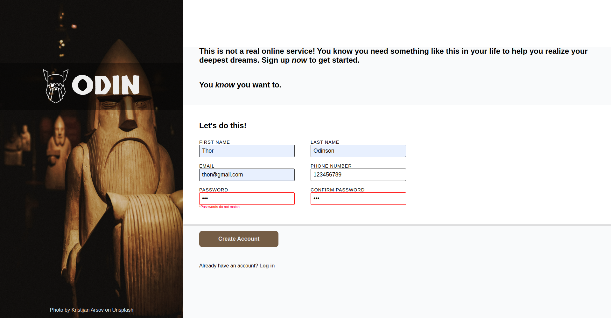

# sign-up-form

A simple sign up form created with html, css and js

## Screenshot

## Acknowledgements

- Project idea and design by [The Odin Project](https://www.theodinproject.com/lessons/node-path-intermediate-html-and-css-sign-up-form)
- Photo by [Kristijan Arsov](https://unsplash.com/@aarsoph) on [Unsplash](https://unsplash.com/)

## Author

[Sergio García](https://github.com/sergiogarciiam)

## License

This project is open source and available under the [MIT License](./LICENSE).
